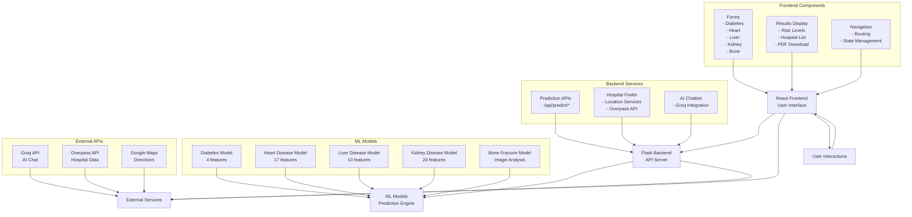
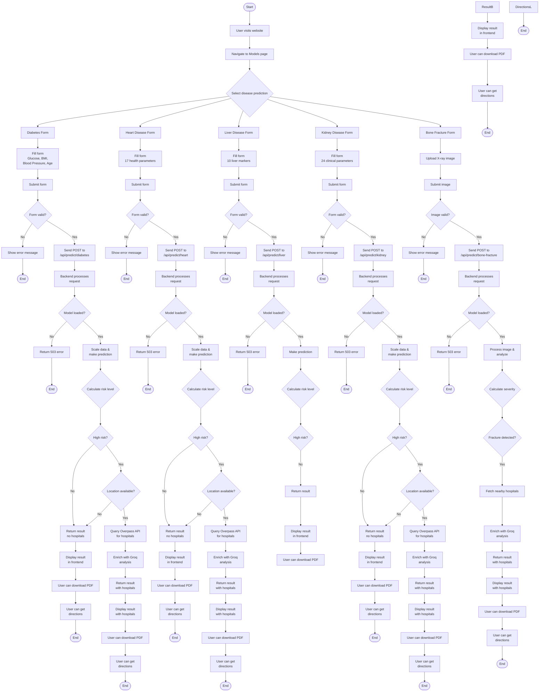
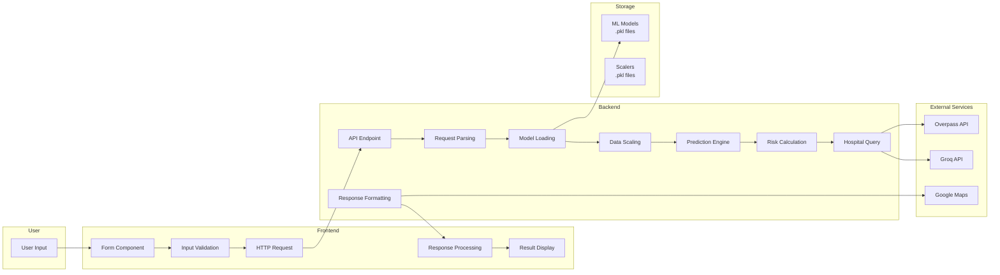
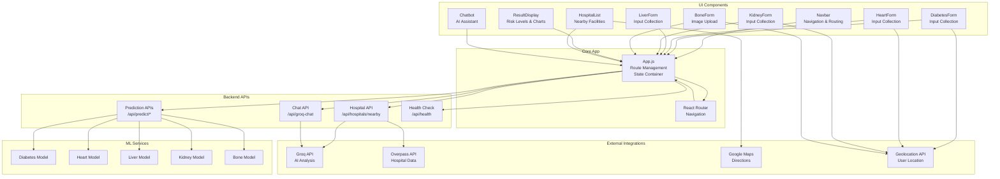

# Healthcare Prediction System Diagrams

## System Architecture (Block Diagram)

### Architecture Description
- **React Frontend**: Handles user interactions, form submissions, result display, and UI management
- **Flask Backend**: Processes API requests, manages ML model inference, and coordinates external services
- **ML Models**: Pre-trained scikit-learn models stored as pickle files for disease prediction
- **External Services**: Third-party APIs for AI chat, hospital data, and mapping functionality

## User Flow Chart

### Flow Chart Description
This comprehensive flow chart shows the complete user journey through the healthcare prediction system, including:
- Disease selection and form filling
- Input validation and error handling
- Backend processing and model inference
- Risk assessment and hospital recommendations
- Result display with additional features (PDF download, directions)

## Data Flow Diagram

### Data Flow Description
- **User Input**: Health parameters entered through forms
- **Frontend Processing**: Validation, API calls, and result rendering
- **Backend Processing**: Model inference, risk calculation, and external API integration
- **External Services**: Hospital data, AI analysis, and mapping services
- **Storage**: Pre-trained ML models and data scalers

## Component Interaction Diagram

### Component Interaction Description
- **UI Components**: Individual React components for different features
- **Core App**: Main application logic and state management
- **Backend APIs**: Flask endpoints for predictions and services
- **ML Services**: Disease prediction models
- **External Integrations**: Third-party services for enhanced functionality

These Mermaid diagrams provide interactive, professional visualizations of the Healthcare Prediction System's architecture and workflows. They can be rendered in GitHub, documentation platforms, or any Mermaid-compatible viewer.
